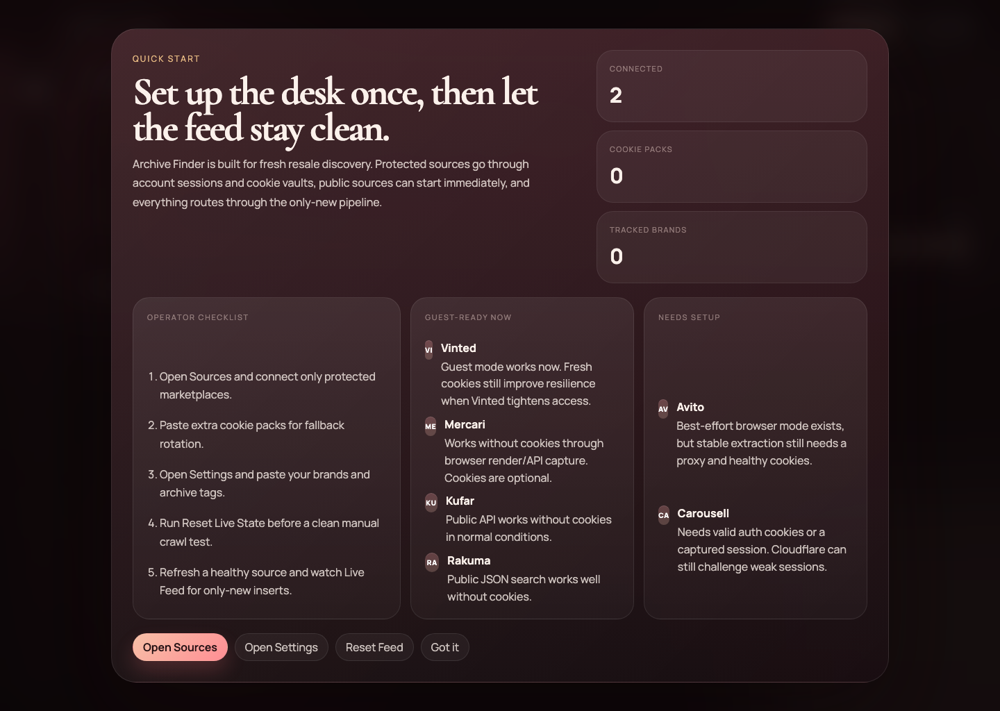
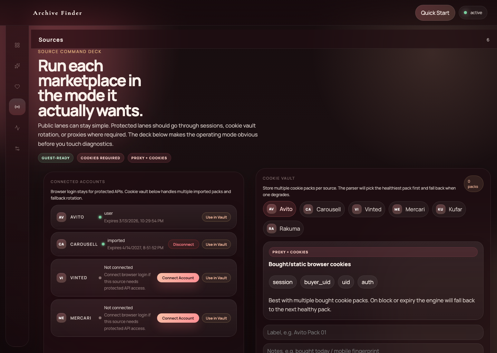
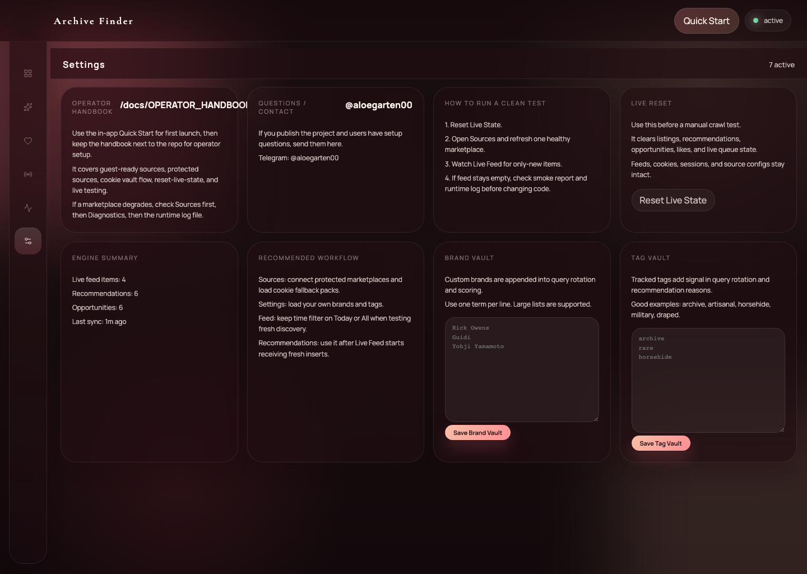

# Archive Finder

Desktop-first designer resale crawler for fresh listings only.

Archive Finder is not a swipe app and not a raw scraping dashboard. It is a working resale discovery engine focused on:

- only-new listings
- lower noise
- operator-friendly source control
- custom brand tracking
- desktop workflow first

## Screens







## Why this exists

Most resale crawlers collect too much stale junk and make operators manually sift through it.

Archive Finder tries to do the opposite:

- keep the live feed limited to fresh listings
- score listings by actual resale interest
- explain why a source is healthy or failing
- let operators bring their own cookies, sessions, brands, and tags

## What works now

Core product:

- mac desktop build
- live feed
- recommendations
- liked items
- sources control panel
- diagnostics
- settings with custom brands and tags

Runtime / backend:

- Fastify API
- SQLite store
- Socket.IO realtime updates
- BullMQ + Redis in server mode
- standalone in-process runtime in packaged desktop mode

Source / crawler stack:

- Mercari JP
- Vinted
- Rakuma
- Kufar
- Carousell
- Avito

## Source reality

Not every source has the same setup needs.

### Guest-ready

- Mercari JP
- Vinted
- Rakuma
- Kufar

### Cookies or session required

- Carousell

### Proxy plus cookies recommended

- Avito

The app already reflects this in `Sources` with capability badges.

## Only-new pipeline

The engine is built around freshness.

Pipeline:

1. source parser extracts listing candidates
2. listing age is normalized per source
3. if age is known and `> 60 minutes`, the listing is skipped
4. unknown-age items are penalized and do not go into the strict live path by default
5. recommendation scoring runs only after freshness/noise checks
6. accepted listings are inserted and emitted in realtime

## Recommendation model

Recommendations are no longer just brand matches.

The score combines:

- brand strength
- category demand
- archive/rarity tags
- price opportunity
- freshness
- source reliability
- tracked custom brands and tags
- noise penalties
- unknown-age penalties

## Cookie Vault

You can store multiple cookie packs per source.

Supported inputs:

- raw cookie string
- JSON cookie array
- simple key/value cookie object

If one pack degrades, the engine can move to the next healthy pack.

## Brand Vault / Tag Vault

The app ships with a base brand catalog, but operators can add their own lists.

Use cases:

- paste 200-300 brand names
- add niche archive tags
- bias query rotation toward your own market

These terms affect:

- matching
- query generation
- recommendation reasons
- scoring

## Main screens

- `Live Feed`
- `Recommendations`
- `Liked`
- `Sources`
- `Diagnostics`
- `Settings`

## First launch

1. Open the app.
2. Read `Quick Start`.
3. Go to `Sources`.
4. Add cookie packs or connect sessions where needed.
5. Go to `Settings`.
6. Paste your own brands and tags.
7. Run `Reset Live State` before a clean manual test.

## Development

```bash
cd "/Users/mac/Documents/New project"
npm install
npm run migrate
npm run dev
```

Client:

- [http://127.0.0.1:5173](http://127.0.0.1:5173)

API health:

- [http://127.0.0.1:4000/api/health](http://127.0.0.1:4000/api/health)

## Run the Electron shell in dev

```bash
npm run desktop:dev
```

## Build the mac app

```bash
npm run desktop:build:mac
```

Result:

- [Archive Finder.app](/Users/mac/Documents/New%20project/release/mac-arm64/Archive%20Finder.app)

## Clean test flow

```bash
npm --workspace server run reset-live-state
```

Expected result:

- `Live Feed` starts empty
- after refreshing a healthy source, only fresh listings should appear

## Source smoke check

```bash
npm --workspace server run smoke:sources
cat data/release-smoke.txt
```

## Important docs

- [Operator Handbook](/Users/mac/Documents/New%20project/docs/OPERATOR_HANDBOOK.md)
- [mac Release Test](/Users/mac/Documents/New%20project/docs/mac-release-test.md)
- [Launch Post](/Users/mac/Documents/New%20project/docs/LAUNCH_POST.md)

## Contact

Questions about setup or operation:

- Telegram: [@aloegarten00](https://t.me/aloegarten00)

## Design note

The current visual direction was explored with AI assistance, but the product logic, runtime architecture, parsers, scoring, and desktop packaging are implemented in this repository.

## License

MIT
